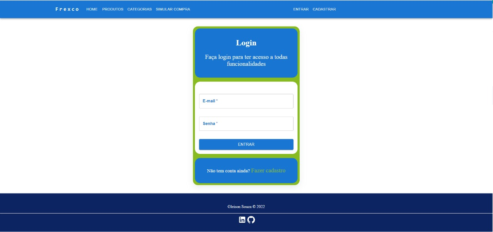
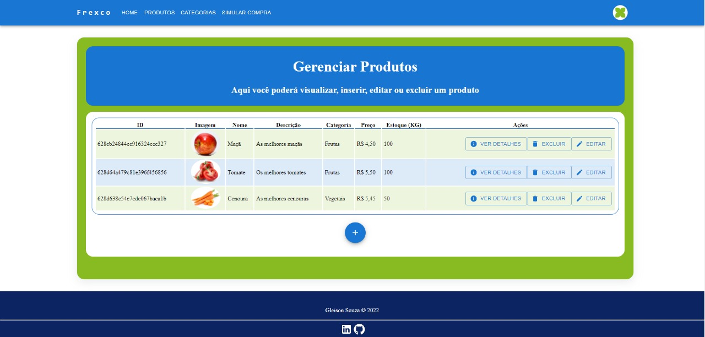
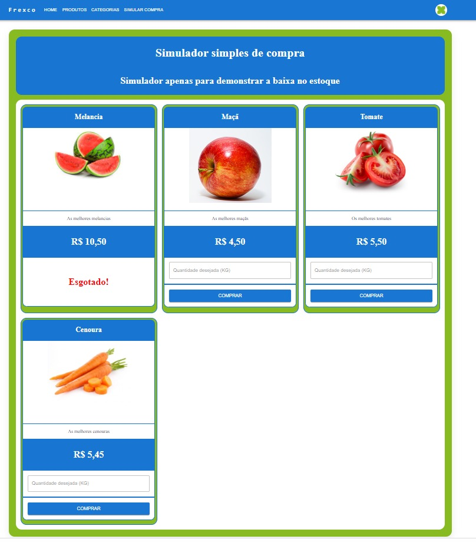

<h2>Apresentação</h2>
        

          Olá, é com muito orgulho que apresento o projeto que desenvolvi para o desafio promovido pela empresa Frexco, esse projeto apesar de ser simples envolve várias funcionalidades 
          por trás de sua simplicidade, tais como validação de autenticação por JWT, validações das requisições tanto no back-end quanto no front-end, restrições de acesso para usuários não autenticados.          
        

        
Confira o sistema online <a href='https://frexcochallenge.netlify.app/'> clicando aqui </a>
  
        <h2>O que podemos encontrar nesse projeto?</h2>    
        <ul>
          <li>Cadastro e edição de usuário</li>
          <li>Login/logout</li>
          <li>CRUD completo de produtos com foto</li>
          <li>Controle de estoque</li>
          <li>Histórico de compras</li>
          <li>CRUD completo de categorias</li>
          <li>Simulação de compras</li>
        </ul>
        <h2>Quais técnologias foram utilizadas?</h2>
        <h3>Back-end</h3>
        <ul>
          <li>Node</li>
          <li>Bcryptjs</li>
          <li>Express / express-validator</li>
          <li>JWT</li>
          <li>Mongoose</li>
          <li>Multer</li>
          <li>Banco de dados MongoDB Atlas</li>
        </ul>
        <h3>Front-end</h3>
        <ul>
          <li>ReactJS</li>
          <li>React router dom</li>
          <li>Redux e redux/toolkit</li>
          <li>Mui material</li>
        </ul>

<h2>Instalação</h2>

<h3>Back-end</h3>

Primeiro de tudo, renomeie o arquivo  `.env-copy`  para `.env`  é nele que contem as informações necessárias para acessar a base de dados e também a  chave de criptografia do JWT.

Eu resolvi deixar as minhas configurações nele para que possam acessar a minha base de dados que está na MongoDB Atlas.
Abra o terminal na pasta backend e digite `npm i`
Execute o servidor digitando `npm run server`

<h3>Front-end</h3>

Abra a pasta frontend no terminal e digite `npm i`

Aguarde a instalação e inicie o servidor digitando `npm start`

Feito isso já será possível utlizar de todo sistema, caso queira usar seu banco de dados, basta alterar as configurações no arquivo `.env` e reiniciar o nodemon

